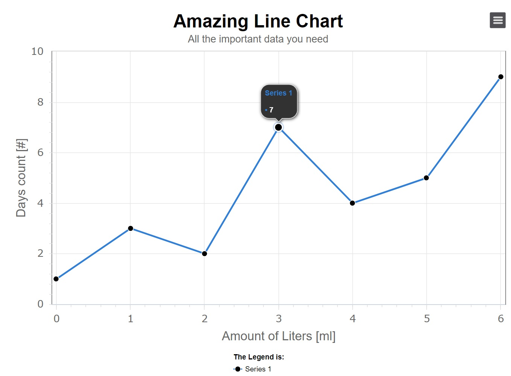
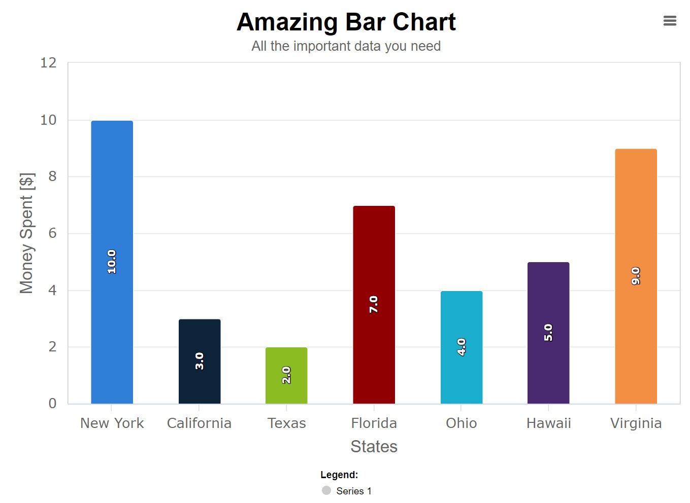

# LOWCHARTS

`Lowcharts` is a small POC project created by [@Tal Kohavy](https://github.com/talkohavy).
`Lowcharts` uses [highcharts](https://www.npmjs.com/package/highcharts) and [highcharts-react-official](https://www.npmjs.com/package/highcharts-react-official) under the hood.
[highcharts](https://www.npmjs.com/package/highcharts) is a JavaScript charting library based on SVG rendering. It has like a MILLION options and features, which is a good thing, but not without its drawbacks. Having so many options & features to offer makes the learning curve very stiff for a developer coming across it for the first time.
`Lowcharts` is made to be a performant, developer-friendly tool, with an ***EXTREMELY FAST*** learning curve, all while still maintaining the vast majority of what highcharts has to offer.

To top it off, `lowcharts` uses the library [react-grid-layout](https://github.com/react-grid-layout/react-grid-layout), to help you create beautiful dashboards with widgets containing your custom-made charts!


## 1. Getting Started

## - Using The Components

As of now, `lowcharts` has to offer these components:
- LineChart
- BarChart
- XBarControlChart
- Dashboards & Widgets
- PieChart (coming soon...)

### Basic LineChart

Creating your first LineChart is simple, easy, and intuitive:

```jsx
import React from 'react'
import LineChart from '@src/highcharts/LineChart'

export default function App(){

  return (
    <div>
      <LineChart
        title='My Amazing Line Chart'
        subtitle='All the important data you need'
        xAxisLabel='Amount of Liters [ml]'
        yAxisLabel='Days count [#]'
        legendTitleText='The Legend is:'
        series={[{ data: [1, 3, 2, 7, 4, 5, 9] }]}
        lineWidth={1}
        isDarkMode={false}
      />
    </div>
  )
} 
```
Graph end result:



### Basic BarChart

Creating A LineChart is no different - easy and simple:

```jsx
import React from 'react'
import BarChart from '@src/highcharts/BarChart'

export default function App(){

  return (
    <div>
      <BarChart
        title='Amazing Bar Chart'
        subtitle='All the important data you need'
        xAxisLabel='States'
        yAxisLabel='Money Spent [$]'
        legendTitleText='Legend:'
        series={[{ data: [10, 3, 2, 7, 4, 5, 9] }]}
        categories={['New York', 'California', 'Texas', 'Florida', 'Ohio', 'Hawaii', 'Virginia']}
        colorful={true}
        isDarkMode={isDarkMode}
      />
    </div>
  )
} 
```

Graph end result:


## 2. Advanced Options
TODO: need to add to this part...
- Talk about the Dark Theme
- Talk about PlotLines for LineChart
- Talk about categories for BarChart


## 3. Dashboards
TODO: need to add to this part...
- Talk about what props does a dashboard accepts
- Talk about widgets

## 4. Available Scripts & Demos

### `npm run dev`

Runs the demo app in the development mode.\
App is programmed to open a browser automatically on [http://localhost:3000](http://localhost:3000).
Uses vite's powerful dev-server, with fast HMRs.
The page will reload if you make edits.\
You will also see any lint errors in the console.

### `npm run build`

Builds the app for production to a folder called `dist`.\
Again, uses vite behind the scenes. It runs the `vite build` command.\
By default, it uses <root>/index.html as the build entry point, and produces an application bundle that is suitable to be served over a static hosting service. The build is minified with source-maps.\
Your app is ready to be deployed!

### `npm run preview`

Once you've built the app, you may test it locally by running npm run preview command.
This command activates a vite feature.
The preview command will boot up a local static web server that serves the files from dist at http://localhost:3001.
It's an easy way to check if the production build looks OK in your local environment.
It is important to note that `vite preview` is intended for previewing the build locally and not meant as a production server.
